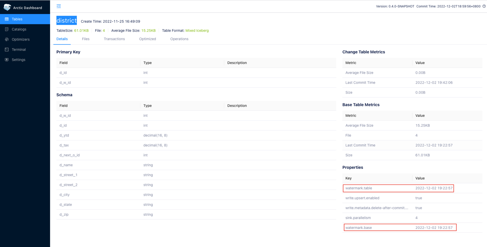

[AMS Dashboard](http://localhost:1630) 中提供了 SQL 执行工具 `Terminal` 帮组用户快速完成表的创建、修改与删除操作。
同时还可以在 [Spark](../spark/spark-ddl.md) 和 [Flink](../flink/flink-ddl.md) 等引擎中使用 SQL 完成表的管理。

## 新建表
登录 [AMS Dashboard](http://localhost:1630) 后，进入 `Terminal`，输入建表语句并执行即可完成表的创建。
下面是一个建表的例子：

```sql
create table test_db.test_log_store(
  id int,
  name string,
  op_time timestamp,
  primary key(id)
) using arctic
partitioned by(days(op_time))
tblproperties(
  'log-store.enable' = 'true',
  'log-store.type' = 'kafka',
  'log-store.address' = '127.0.0.1:9092',
  'log-store.topic' = 'local_catalog.test_db.test_log_store.log_store',
  'table.event-time-field ' = 'op_time',
  'table.watermark-allowed-lateness-second' = '60');
```

当前 Terminal 使用 Spark Engine 完成 SQL 的执行，更多有关建表的语法参考 [Spark DDL](../spark/spark-ddl.md#create-table)。不同 Catalog 创建的表格式不同，可参考 [创建Catalog](managing_catalogs.md#catalog)

### 配置 LogStore
如 [Mixed streaming format](../concepts/table-formats.md#mixed-streaming-format) 所述，Mixed streaming format 可能由几部分共同组成，BaseStore 与 ChangeStore 会随着表的创建而自动创建，
LogStore 作为可选组件则需要另外的配置来指明，有关 LogStore 的完整配置可以参考 [LogStore相关配置](../configurations.md#logstore)。

上面的例子中将 kafka 集群：`127.0.0.1:9092`中的 topic：`local_catalog.test_db.test_log_store.log_store`作为了新建表的 LogStore,
而在执行上面的语句之前你还需要手动去对应的 Kafka 集群中创建对应的 topic，或者打开集群的自动创建 topic 功能。

### 配置 Watermark
水位（watermark） 用于表述表的写入进度，具体来说它是表上的一个类型为时间戳的属性，意为小于这个时间戳的数据都已经写入到表中，它一般用来观察表的写入进度，也可以作为下游批量计算任务的触发指标。

上面的例子中将 `op_time` 设置为表的事件时间字段，在数据写入时会用写入数据的 `op_time` 来计算表的水位，同时为了应对写入乱序的问题，设置在计算水位时允许的数据迟到时间为一分钟。
可以在 [AMS Dashboard](http://localhost:1630) 的表详情中看到表当前的水位，



也可以在`Terminal`中输入下面的 SQL 来查询表的水位：

```sql
SHOW TBLPROPERTIES test_db.test_log_store ('watermark.table');
```

预期你将得到以下的结果：

```text
+-----------------+---------------+
| key             | value         |
+-----------------+---------------+
| watermark.table | 1668579055000 |
+-----------------+---------------+
```
???+ 注意

    只支持在 Mixed hive format 和 Mixed Iceberg format 配置watermark, 不支持在 Iceberg 上配置。

## 修改表

登录 [AMS Dashboard](http://localhost:1630) 后，进入 `Terminal`，输入修改语句并执行即可完成表的修改。
下面是一个新增字段的的例子：

```sql
ALTER TABLE test_db.test_log_store ADD COLUMN new_column string comment 'new_column docs';
```

当前 Terminal 使用 Spark Engine 完成 SQL 的执行，更多有关修改表的语法参考 [Spark DDL](../spark/spark-ddl.md#alter-table)。

## 升级 Hive 表
Arctic 支持 [Mixed Hive format](../concepts/table-formats.md#mixed-hive-format)，通过组合 Hive format 的能力在 Hive 之上直接实现新型 table format 的能力。有关升级后 Mixed Hive 表拥有的功能可以参考 [Mixed Hive](../concepts/table-formats.md#mixed-hive-format)。

登录 [AMS Dashboard](http://localhost:1630) 后，从菜单中的 `Tables` 中选择某个 Hive Catalog 下的一张表，即可进行升级操作。


点击表详情右上角的 `Upgrade` 按钮（已经完成升级的 Hive 表不再显示此按钮）。


在升级界面为表选择主键，并添加额外的参数，之后点击 `OK` 完成 Hive 表的升级操作。

## 配置Self-optimizing

Arctic 提供了 Self-optimizing 的功能，Self-optimizing 需要在表配置的 Optimizer Group 中有活跃的 Optimizer。

### 修改 Optimize Group
如果要使用在特定的 [Optimizer Group](managing_optimizers.md#optimizer-group) 下启动的 Optimizer 执行 Self-optimizing，则需要修改表的 `self-optimizing.group` 参数，为表指定特定的资源池，设置方式如下：

```sql
ALTER TABLE test_db.test_log_store set tblproperties (
    'self-optimizing.group' = 'group_name');
```

默认情况下，`'self-optimizing.group' = 'default'`。

### 调整 Optimize 资源

如果同一个 Optimizer Group 下有多张表要执行 Optimize，可以通过调整 `quota` 来手动调整每张表的资源占比：

```sql
ALTER TABLE test_db.test_log_store set tblproperties (
    'self-optimizing.quota' = '0.1');
```

更多信息请参考 [Self-optimizing quota](../concepts/self-optimizing#self-optimizing-quota)。

### 设置 Optimize 参数

可以手动设置不同类型的 Optimize 的执行间隔、任务大小、执行超时时间等参数，比如设置 major 类型的 Self-optimize 的执行间隔如下：

```sql
ALTER TABLE test_db.test_log_store set tblproperties (
    'self-optimizing.major.trigger.interval' = '3600000');
```

更多 Optimize 参数调整参考 [Self-optimizing配置](../configurations.md#Self-optimizing)。

### 开启和关闭 Optimize

表的 Optimize 默认即处于开启状态，如果要关闭 Optimize 功能，执行以下命令，反之可以重新开启：

```sql
ALTER TABLE test_db.test_log_store set tblproperties (
    'self-optimizing.enabled' = 'false');
```

## 删除表

登录 [AMS Dashboard](http://localhost:1630) 后，进入 `Terminal`，输入修改语句并执行即可完成表的修改。
下面是一个删除表的的例子：

```sql
DROP TABLE test_db.test_log_store;
```

当前 Terminal 使用 Spark Engine 完成 SQL 的执行，更多有关删除表的语法参考 [Spark DDL](../spark/spark-ddl.md#drop-table)。
